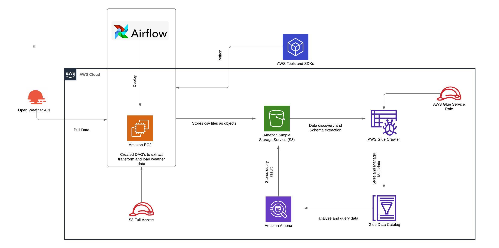
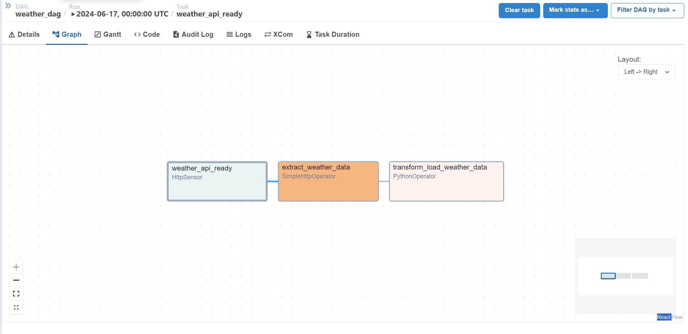
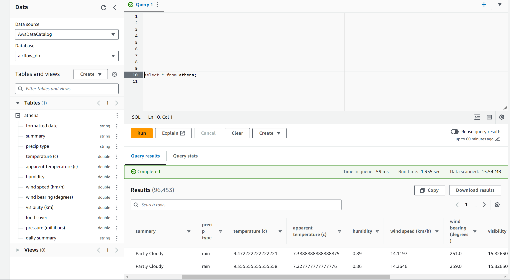

# Weather Data ETL with Apache Airflow

## Project Overview
This project demonstrates an ETL (Extract, Transform, Load) pipeline using Apache Airflow. The pipeline extracts weather data from the OpenWeatherMap API, transforms it, and loads it into an AWS S3 bucket. The data is then cataloged using AWS Glue and made available for ad hoc analysis in AWS Athena.

## Architecture
- EC2 Instance: The Airflow instance runs on an EC2 t2.small instance within a Python virtual environment.
- Airflow DAGs: Directed Acyclic Graphs (DAGs) are created using Python scripts in Airflow.
- OpenWeatherMap API: Data is extracted from the OpenWeatherMap API.
- Data Transformation: Performed within the Airflow DAG.
- AWS S3: Transformed data is stored as CSV files in an S3 bucket.
- AWS Glue: A Glue Crawler extracts the schema and stores the metadata in the AWS Glue Data Catalog.
- AWS Athena: Metadata in Glue is used to create tables in Athena for ad hoc querying and analysis.

  

## Prerequisites
- AWS Account
- EC2 instance with Airflow deployed
- S3 bucket
- OpenWeatherMap API key
- AWS Glue and Athena setup

## Workflow
- Data is extracted from the OpenWeatherMap API
- Airflow DAGs process and transform the data
- Transformed data is saved as CSV files in AWS S3
- AWS Glue Crawler extracts the schema and stores metadata in the AWS Glue Data Catalog
- Data is made available for querying in AWS Athena

## Setup Instructions
# 1. EC2 Instance Setup
- Launch an EC2 t2.small instance.
- Connect to Instance.
- Inside the EC2 terminal run these commands to create a virtual env and install python dependencies plus airflow
  - sudo apt update
  - sudo apt install python3-pip
  - sudo apt install python3.10-venv
  - python3 -m venv airflow_venv
  - source airflow_venv/bin/activate
  - sudo pip install pandas
  - sudo pip install s3fs
  - sudo pip install apache-airflow
  - airflow standalone
- Airflow userid and password will be displayed and launch it through publiv IPv4 insatnce URL on EC2 details page
# 2. Create DAG's and transformation using python code weather_dag.py

# 3. AWS Glue Setup
- Create a Glue Crawler to crawl the S3 bucket and extract the schema.
- Store the metadata in the Glue Data Catalog.
# 4. AWS Athena Setup
- Use Athena to create tables based on the metadata stored in Glue.
- Query the tables for ad hoc analysis.
  
## Conclusion
This ETL pipeline showcases how to automate data extraction, transformation, and loading using Apache Airflow, AWS S3, AWS Glue, and AWS Athena. It provides a robust framework for handling weather data and performing ad hoc analysis.

